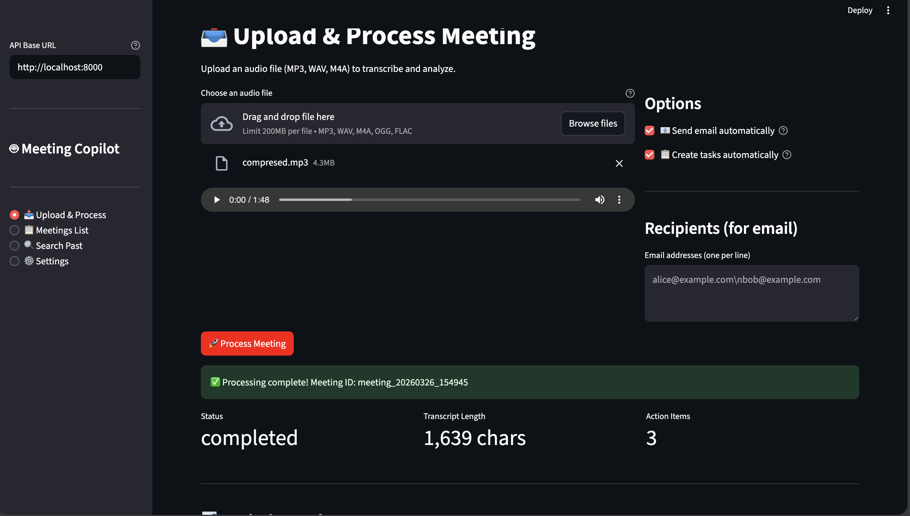
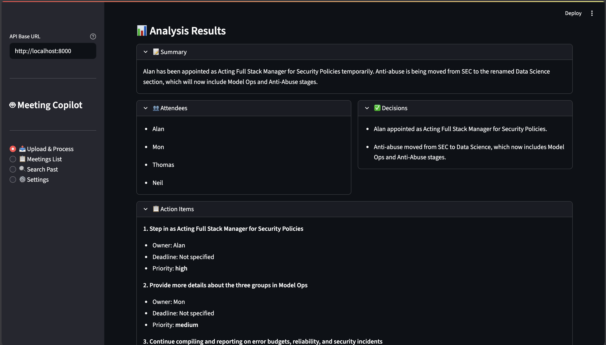

# 🤖 Meeting Copilot
<p align="center">
  
</p>
An AI-powered meeting assistant that transcribes audio, extracts insights, creates tasks, and automates follow-ups.

---


## 📸 Demo

### 🧾 Upload & Process Meeting
<p align="center">
  
</p>

### 📊 Analysis Results
<p align="center">
  
</p>

## Features

- **Audio Transcription** - High-quality transcription with speaker diarization using Azure OpenAI gpt-4o-transcribe
- **Smart Analysis** - Extracts summaries, action items, decisions, and attendees using GPT-4o
- **Task Automation** - Creates tasks automatically in Notion from action items
- **Email Summaries** - Sends meeting summaries to attendees via Gmail
- **RAG Memory** - Semantic search across all past meetings using ChromaDB + sentence-transformers
- **FastAPI Backend** - RESTful API for all operations
- **Streamlit Dashboard** - Beautiful, easy-to-use web interface

**Note:** Sample test audio files are not included in the repository. Please provide your own audio files for testing.

## Architecture

```
┌─────────────────┐     ┌──────────────────┐     ┌─────────────────┐
│   Audio File    │────▶│  Transcription   │────▶│ Labeled         │
│   (.wav, .mp3)  │     │  Agent           │     │ Transcript      │
└─────────────────┘     └──────────────────┘     └─────────────────┘
                                                            │
                                                            ▼
┌─────────────────┐     ┌──────────────────┐     ┌─────────────────┐
│   RAG Memory    │◀────│   Analyzer       │◀────│   Orchestrator  │
│   (ChromaDB)    │     │   Agent (GPT-4o) │     │   (Pipeline)    │
└─────────────────┘     └──────────────────┘     └─────────────────┘
                                   │
                                   ▼
                    ┌──────────────────────────┐
                    │   Task Agent & Email     │
                    │   Agent (Notion/Gmail)   │
                    └──────────────────────────┘
```

## Quick Start

### 1. Installation

```bash
# Clone and setup
cd meeting-copilot
python -m venv venv

# Activate virtual environment
# On macOS/Linux:
source venv/bin/activate
# On Windows:
venv\Scripts\activate

# Install dependencies
pip install -r requirements.txt
```

### 2. Configure Environment Variables

Create `.env` file in project root:

```bash
# ============================================
# Azure OpenAI - GPT-4o (Analysis)
# ============================================
AZURE_OPENAI_ENDPOINT=https://your-resource.openai.azure.com/
AZURE_OPENAI_API_KEY=your-api-key-here
AZURE_OPENAI_DEPLOYMENT=gpt-4o
AZURE_OPENAI_API_VERSION=2024-12-01-preview

# ============================================
# Azure OpenAI - Transcription (France Central)
# ============================================
AZURE_TRANSCRIBE_ENDPOINT=https://your-transcribe-resource.openai.azure.com/
AZURE_TRANSCRIBE_API_KEY=your-transcribe-api-key
AZURE_TRANSCRIBE_DEPLOYMENT=gpt-4o-transcribe

# ============================================
# Azure Blob Storage (for audio uploads)
# ============================================
AZURE_STORAGE_CONNECTION_STRING=DefaultEndpointsProtocol=https;AccountName=...;AccountKey=...;EndpointSuffix=...
AZURE_STORAGE_CONTAINER_NAME=meetings

# ============================================
# API Authentication (Required)
# ============================================
# Generate a secure random key: openssl rand -hex 32
API_KEY=your-secret-api-key-here

# ============================================
# CORS Configuration (Optional)
# ============================================
# Comma-separated list of allowed origins for CORS
# Default: http://localhost:8501
ALLOWED_ORIGINS=http://localhost:8501

# ============================================
# Optional: Gmail Integration
# ============================================
# Download OAuth credentials from Google Cloud Console and save as gmail_credentials.json
# (No env vars needed, uses credentials.json file)

# ============================================
# Optional: Notion Integration
# ============================================
NOTION_API_KEY=secret_your-integration-token
NOTION_DATABASE_ID=your-database-id
```

### 3. Optional: Setup External Services

#### Gmail API (for sending emails)

1. Go to [Google Cloud Console](https://console.cloud.google.com)
2. Create new project or select existing
3. Enable **Gmail API**
4. Create OAuth 2.0 credentials (Desktop app)
5. Download as `gmail_credentials.json` in project root
6. First run will open browser for authorization

#### Notion (for task creation)

1. Go to [Notion Developers](https://www.notion.so/my-integrations)
2. Create new integration, copy the token
3. Create a database in Notion with properties:
   - Name (Title)
   - Status (Select: To Do, In Progress, Done)
   - Assignee (Rich text or People)
   - Due (Date)
   - Priority (Select: High, Medium, Low)
4. Share the database with your integration
5. Copy database ID from URL and set `NOTION_DATABASE_ID` in `.env`

### 4. Run the Application

#### Option A: API Server (for programmatic access)

```bash
uvicorn main:app --reload --host 0.0.0.0 --port 8000
```

Open API docs: http://localhost:8000/docs

#### Option B: Streamlit Dashboard (GUI)

```bash
streamlit run dashboard/app.py
```

Open: http://localhost:8501

#### Option C: Direct Python Script (quick test)

```python
from agents.orchestrator import process_meeting

result = process_meeting(
    file_path="test_meeting.wav",
    send_email=False,
    create_tasks=False
)
print(result)
```

## API Endpoints

| Method | Endpoint | Description |
|--------|----------|-------------|
| GET | `/` | API info |
| GET | `/health` | Health check |
| POST | `/process` | Upload audio and process |
| GET | `/meetings` | List all meetings |
| GET | `/meetings/{id}` | Get meeting details |
| POST | `/meetings/{id}/send-email` | Send summary email |
| POST | `/meetings/{id}/create-tasks` | Create tasks in Notion |
| POST | `/search` | Semantic search past meetings |
| GET | `/actions` | List available actions |

Full interactive documentation: http://localhost:8000/docs

## Usage Examples

### Upload and Process Audio (cURL)

```bash
curl -X POST "http://localhost:8000/process" \
  -H "accept: application/json" \
  -H "X-API-Key: your-api-key-here" \
  -F "audio=@meeting.wav" \
  -F "send_email=false" \
  -F "create_tasks=true"
```

### List All Meetings

```bash
curl "http://localhost:8000/meetings"
```

### Get Specific Meeting

```bash
curl "http://localhost:8000/meetings/meeting_20240326_143022"
```

### Search Past Meetings

```bash
curl -X POST "http://localhost:8000/search" \
  -H "Content-Type: application/json" \
  -d '{"query": "project timeline", "k": 5}'
```

## Project Structure

```
meeting-copilot/
├── agents/
│   ├── analyzer_agent.py      # Transcript analysis with GPT-4o
│   ├── transcription_agent.py # Audio transcription with diarization
│   ├── orchestrator.py        # Pipeline coordinator
│   ├── email_agent.py         # Email composition and sending
│   └── task_agent.py          # Task creation from action items
├── integrations/
│   ├── gmail.py               # Gmail API client
│   ├── google_calendar.py     # Google Tasks API (coming soon)
│   └── notion.py              # Notion API client
├── memory/
│   └── rag.py                 # ChromaDB + sentence-transformers RAG
├── utils/
│   └── azure_clients.py       # Azure OpenAI & Blob clients
├── dashboard/
│   └── app.py                 # Streamlit dashboard
├── outputs/                   # Saved meeting JSON files (auto-created)
├── memory/
│   └── chroma_db/            # ChromaDB persistent storage (auto-created)
├── main.py                   # FastAPI application
├── requirements.txt          # Python dependencies
└── .env                      # Environment variables (create your own)

```

## How It Works

1. **Upload Audio** - User uploads audio file via API or dashboard
2. **Transcription** - Audio sent to Azure OpenAI gpt-4o-transcribe-diarize with speaker diarization
3. **Analysis** - Transcript analyzed by GPT-4o to extract structured data:
   - 2-3 sentence summary
   - List of action items (owner, task, deadline, priority)
   - Decisions made
   - Attendee names
4. **Storage** - Results saved to `outputs/meeting_TIMESTAMP.json` with cache
5. **Optional Follow-ups:**
   - **Tasks created** in Notion database (if configured)
   - **Email sent** to attendees with meeting summary (if configured)
6. **RAG Indexing** - Transcript chunks stored in ChromaDB for future retrieval
7. **Search** - Users can search past meetings semantically

## Configuration

All secrets and configuration via environment variables (see `.env` section above). The system checks for credentials and gracefully degrades:

- If Gmail credentials missing → prints email to console
- If Notion credentials missing → skips task creation
- If transcript file is .txt → skips transcription step

## Testing

### Run Unit Tests (individual agents)

```bash
# Test transcription agent (requires audio file in current dir)
python agents/transcription_agent.py

# Test analyzer agent
python agents/analyzer_agent.py

# Test Notion integration
python integrations/notion.py

# Test Gmail integration
python integrations/gmail.py

# Test RAG memory
python memory/rag.py

# Test orchestrator
python agents/orchestrator.py
```

### End-to-End Test

1. Start API: `uvicorn main:app --reload`
2. Open dashboard: `streamlit run dashboard/app.py`
3. Upload your own audio file (e.g., `meeting.wav`)
4. Verify:
   - Transcription appears
   - Analysis extracted correctly
   - Results saved in `outputs/`

## Environment Variables Reference

| Variable | Required | Purpose |
|----------|----------|---------|
| `AZURE_OPENAI_ENDPOINT` | Yes | Azure OpenAI resource URL |
| `AZURE_OPENAI_API_KEY` | Yes | Azure OpenAI API key |
| `AZURE_OPENAI_DEPLOYMENT` | Yes | Model name (e.g., `gpt-4o`) |
| `AZURE_OPENAI_API_VERSION` | Yes | API version |
| `AZURE_TRANSCRIBE_ENDPOINT` | Yes | Transcription resource URL |
| `AZURE_TRANSCRIBE_API_KEY` | Yes | Transcription API key |
| `AZURE_TRANSCRIBE_DEPLOYMENT` | Yes | Transcription model (gpt-4o-transcribe) |
| `AZURE_STORAGE_CONNECTION_STRING` | Yes | Blob storage connection string |
| `AZURE_STORAGE_CONTAINER_NAME` | Yes | Container name (default: `meetings`) |
| `API_KEY` | Yes | API key for endpoint authentication (generate a secure random string) |
| `ALLOWED_ORIGINS` | No | Comma-separated CORS allowed origins (default: `http://localhost:8501`) |
| `NOTION_API_KEY` | No | Notion integration token (optional) |
| `NOTION_DATABASE_ID` | No | Notion database ID (optional) |

## Troubleshooting

### "Cannot connect to API" error in dashboard
- Ensure FastAPI server is running: `uvicorn main:app --reload`
- Check API_BASE_URL setting in dashboard sidebar

### Transcription fails with "unauthorized"
- Verify `AZURE_TRANSCRIBE_ENDPOINT` and `AZURE_TRANSCRIBE_API_KEY`
- Check deployment name matches: `AZURE_TRANSCRIBE_DEPLOYMENT`

### Gmail OAuth flow doesn't complete
- Ensure `gmail_credentials.json` is in project root
- Check that `http://localhost:8080` (or similar) is not blocked
- Delete `gmail_token.json` to force re-authentication

### Notion task creation fails
- Verify `NOTION_API_KEY` and `NOTION_DATABASE_ID` in `.env`
- Ensure database is shared with the integration
- Check database schema matches expected properties

### ChromaDB/RAG errors
- Install dependencies: `pip install chromadb sentence-transformers`
- First run will download embedding model (~100MB)
- Ensure `memory/chroma_db/` directory is writable

## Advanced Usage

### Run as CLI Tool

```python
#!/usr/bin/env python3
import sys
from agents.orchestrator import process_meeting

if __name__ == "__main__":
    if len(sys.argv) < 2:
        print("Usage: python main.py <audio_file> [--email] [--tasks]")
        sys.exit(1)

    file_path = sys.argv[1]
    send_email = "--email" in sys.argv
    create_tasks = "--tasks" in sys.argv

    result = process_meeting(file_path, send_email=send_email, create_tasks=create_tasks)
    print(json.dumps(result, indent=2))
```

### Custom Notion Database Schema

If your Notion database uses different property names, modify `integrations/notion.py`:

```python
properties = {
    "Your Task Title Property": {  # ← Change this
        "title": [{"text": {"content": title}}]
    },
    # ... other properties
}
```

### Batch Processing

```python
import os
from agents.orchestrator import process_meeting

audio_dir = "batch_audio/"
for filename in os.listdir(audio_dir):
    if filename.endswith(('.wav', '.mp3', '.m4a')):
        filepath = os.path.join(audio_dir, filename)
        print(f"\nProcessing {filename}...")
        result = process_meeting(filepath, create_tasks=True)
        print(f"✓ Done: {result['meeting_id']}")
```

## Deployment

### Docker

```dockerfile
FROM python:3.11-slim

WORKDIR /app
COPY requirements.txt .
RUN pip install -r requirements.txt
COPY . .

CMD ["uvicorn", "main:app", "--host", "0.0.0.0", "--port", "8000"]
```

### Cloud Deployment

**Render / Fly.io / Railway:**
- Set environment variables in dashboard
- Deploy as web service
- Run: `uvicorn main:app --host 0.0.0.0 --port $PORT`

**Streamlit Community Cloud:**
- Deploy dashboard separately
- Dashboard connects to external API server

## License

MIT License - feel free to use for personal or commercial projects.

## Contributing

Contributions welcome! Please:
1. Fork the repos
2. Create a feature branch
3. Make changes with tests
4. Submit a pull requests

## Credits

Built with:
- [Azure OpenAI](https://azure.microsoft.com/en-us/products/ai-services/openai-service)
- [FastAPI](https://fastapi.tiangolo.com/)
- [Streamlit](https://streamlit.io/)
- [ChromaDB](https://www.trychroma.com/)
- [Notion API](https://www.notion.so/help/guides/use-the-notion-api)
- [Gmail API](https://developers.google.com/gmail/api)

---

Built by Vignesh Rathnakumar
